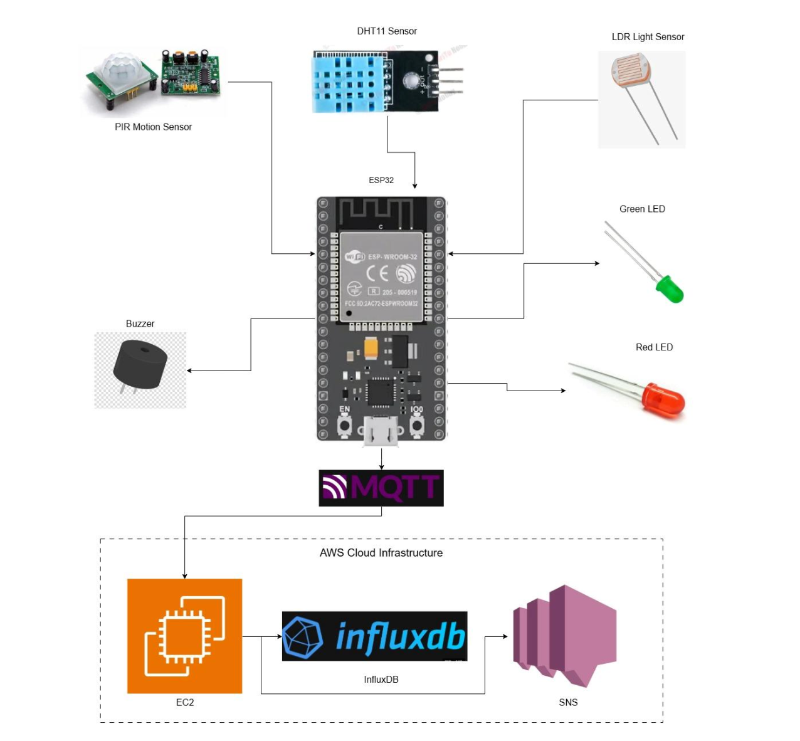
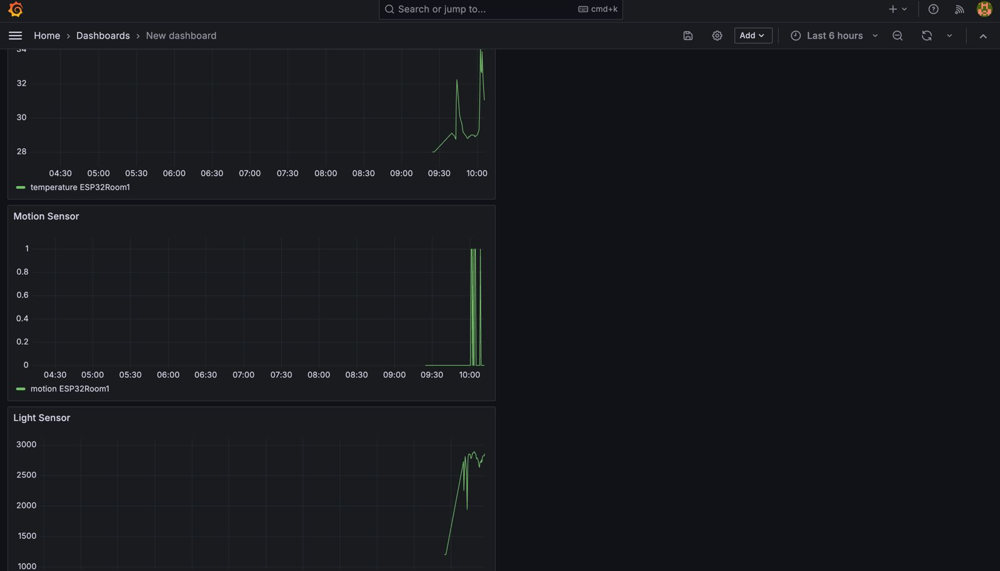
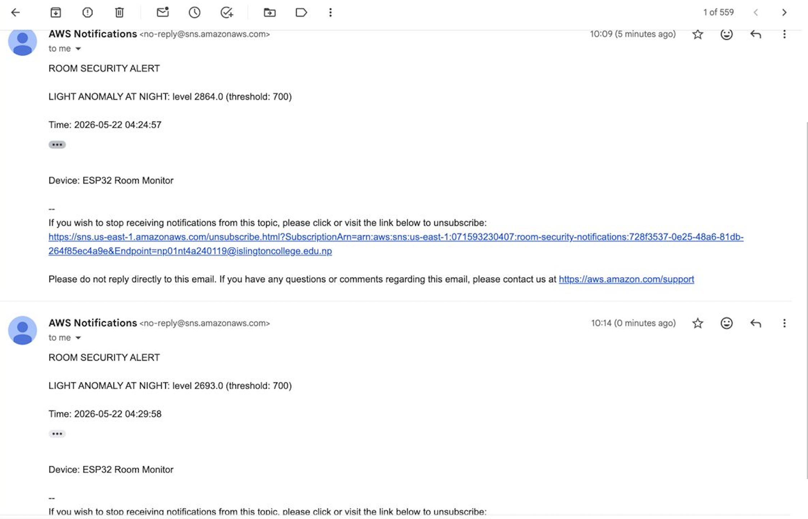

# Room Security Monitor

Cloud-based IoT room monitoring and anomaly detection system built using Docker, MQTT, AWS, InfluxDB, and Grafana.

The system collects real-time sensor data from an ESP32 microcontroller, processes anomalies using a Python MQTT subscriber, stores time-series telemetry in InfluxDB, visualizes metrics in Grafana, and sends automated alerts through Amazon SNS.

---

## System Architecture



---

## Features

- Real-time IoT sensor monitoring
- MQTT-based communication using Mosquitto
- Time-series data storage with InfluxDB 2.x
- Live visualization dashboards using Grafana
- Automated anomaly detection logic
- Email alerts using Amazon SNS
- Dockerized multi-service deployment
- AWS EC2 cloud hosting
- Infrastructure as Code using AWS CloudFormation

---

## Technologies Used

### IoT & Communication
- ESP32
- MQTT
- Mosquitto MQTT Broker

### Backend & Processing
- Python
- Paho MQTT
- Docker
- Docker Compose

### Cloud & Monitoring
- Amazon EC2
- Amazon SNS
- InfluxDB 2.x
- Grafana

### Infrastructure Automation
- AWS CloudFormation

---

## Architecture Overview

### Perception Layer
The ESP32 collects sensor readings from:
- DHT11 temperature sensor
- PIR motion sensor
- LDR light sensor

### Network Layer
Sensor data is transmitted using MQTT through the Mosquitto broker.

### Cloud/Application Layer
A Python MQTT subscriber running inside Docker:
- receives sensor data
- stores telemetry in InfluxDB
- checks anomaly thresholds
- triggers SNS alerts
- provides Grafana dashboards for visualization

---

## Anomaly Detection Logic

The system generates alerts for:

- High temperature spikes
- Motion detected during night hours
- Abnormal light intensity during night hours

Alerts are automatically sent via Amazon SNS email notifications.

---

## Project Screenshots

### Grafana Dashboard



---

### SNS Alert Example



---

## Cloud Infrastructure

AWS infrastructure is provisioned using AWS CloudFormation.

The CloudFormation template automates:
- EC2 instance provisioning
- Security group configuration
- Docker environment setup
- MQTT, InfluxDB, and Grafana deployment

CloudFormation template location:

```text
cloudformation/room-security-stack.yaml
```

---

## Quick Start

### 1. Clone the Repository

```bash
git clone https://github.com/yourusername/room-security-monitor.git
cd room-security-monitor
```

---

### 2. Create Environment File

```bash
cp .env.example .env
```

Update the `.env` file with:
- AWS credentials
- SNS topic ARN
- InfluxDB token
- organization and bucket details

---

### 3. Start Services

```bash
docker compose up -d --build
```

---

## Docker Services

| Service | Port | Purpose |
|---|---|---|
| Mosquitto | 1883 | MQTT Broker |
| InfluxDB | 8086 | Time-Series Database |
| Grafana | 3000 | Monitoring Dashboard |
| Room Subscriber | Internal | Data Processing & Alerts |

---

## MQTT Test Commands

### Subscribe to Sensor Topic

```bash
mosquitto_sub -h localhost -t "room/sensors"
```

### Publish Test Sensor Data

```bash
mosquitto_pub -h localhost -t "room/sensors" -m '{"temp":35,"light":900,"motion":1}'
```

---

## Grafana Access

Open Grafana in browser:

```text
http://YOUR_EC2_PUBLIC_IP:3000
```

---

## Security Notes

- Secrets and credentials are not stored in the repository
- `.env` is excluded using `.gitignore`
- SSH access should be restricted to trusted IP addresses in production

---

## Future Improvements

- Add HTTPS and reverse proxy support
- Add device authentication for MQTT clients
- Implement historical analytics dashboards
- Add SMS/mobile push notifications
- Deploy using Kubernetes or ECS
- Add multiple room/device support

---

## License

This project was developed for educational and cloud/IoT learning purposes.
